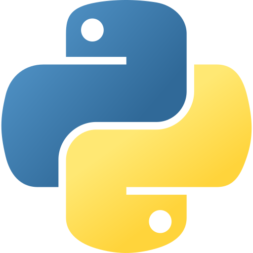
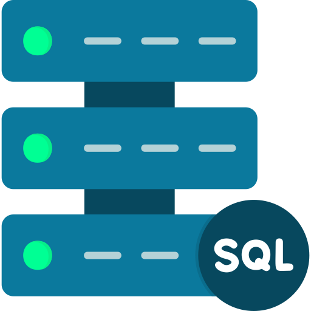
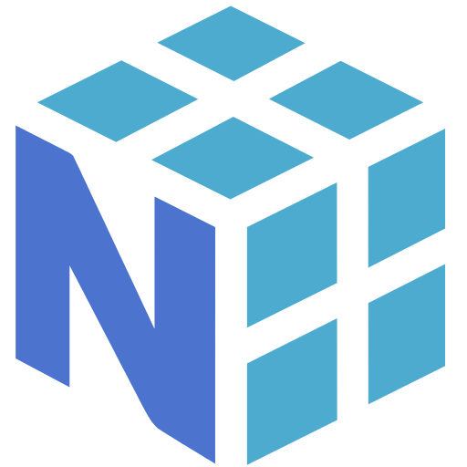
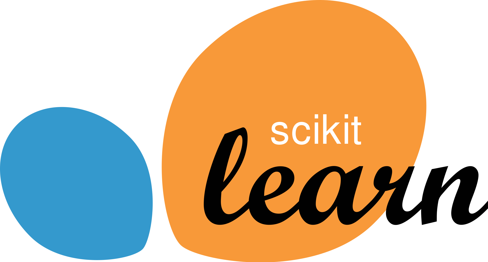

  
  
  # Sai Bhuvanesh Suryadevara
  
  **Data Scientist | AI Engineer**
   
  
  Data Scientist | Masters in CS @GSU | Ex-Optum
   
  
  
  
  

 

## 🚀 About Me

Hello, I'm **Sai**! As a passionate **Data Scientist** and current **Graduate Research Assistant** at **Georgia State University**, I specialize in leveraging advanced machine learning and AI techniques to solve real-world business challenges. 

I am pursuing my **M.S. in Computer Science** (graduating Dec 2025) and have hands-on experience in:
- **NLP & GenAI** (Transformers, LLMs, RAG)
- **Deep Learning** (CNNs, RNNs, LSTM, PyTorch, TensorFlow)
- **Data Engineering** (ETL, SQL, Snowflake)
- **Deployment** (FastAPI, Streamlit, Docker, AWS)

Previously, I contributed as a **Data Scientist at Optum**, where I developed predictive models and optimized large-scale data pipelines. I thrive on transforming complex datasets into actionable insights.

---

## 🛠️ Skills & Technologies

### Languages

  
  
  
  

### Frameworks & Libraries

  
  
  
  
  

### Data Analytics & Visualization

  
  

### Platforms & Tools

  <!-- Including relevant icons found in assets -->
  
  
  
  
  
  

---

## 💻 Projects

### 🤖 [Gen AI PDF Q&A Assistant](#)
**Tech:** Python, LangChain, OpenAI API, Streamlit, FAISS
- Built a RAG-based document assistant enabling users to query PDF content with contextual responses.
- Implemented vector search using FAISS for efficient retrieval.

### 📊 [Churn Prediction](#)
**Tech:** Python, Statistical Analysis, Tableau, Feature Engineering
- Developed a customer churn prediction model with optimized feature engineering.
- Visualized key churn drivers using interactive Tableau dashboards.

### 🌾 [End-to-End House Crop Prediction](#)
**Tech:** Python, ZenML, MLflow, Regression
- Built an end-to-end regression pipeline with MLOps integration.
- Utilized ZenML and MLflow for experiment tracking and scalable deployment.

---

## 📫 Contact

- **Email**: [bhuvaneshsuryadevara@gmail.com](mailto:bhuvaneshsuryadevara@gmail.com)
- **LinkedIn**: [Sai Bhuvanesh Suryadevara](https://www.linkedin.com/in/suryadevarasai/)
- **Location**: Atlanta, United States

<!-- Footer -->

